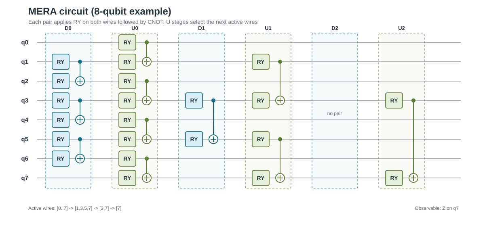
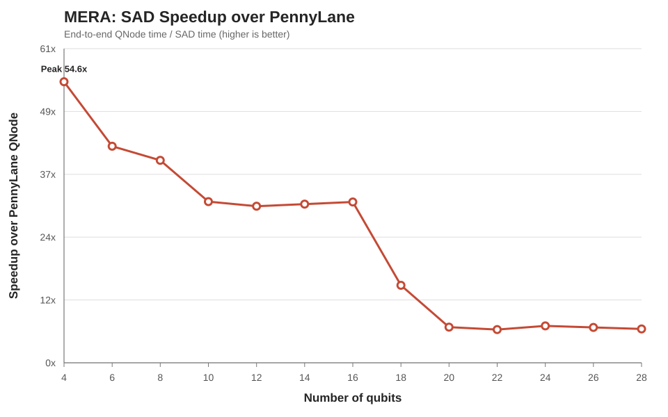
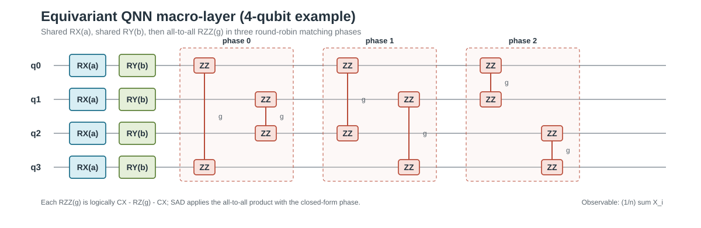
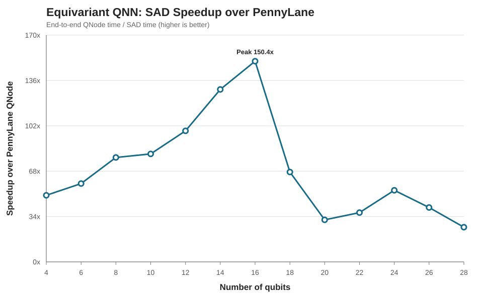
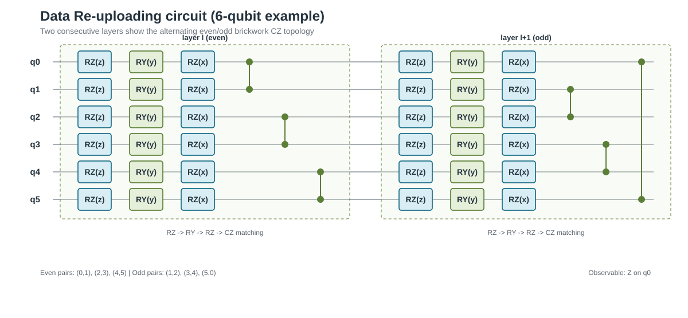
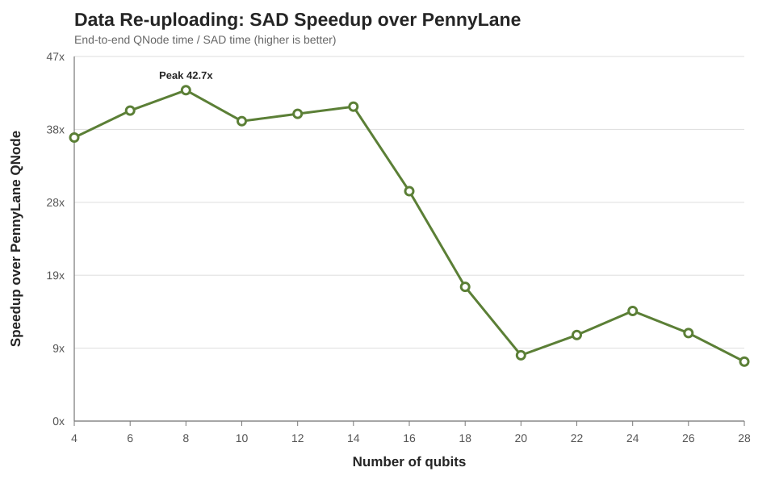
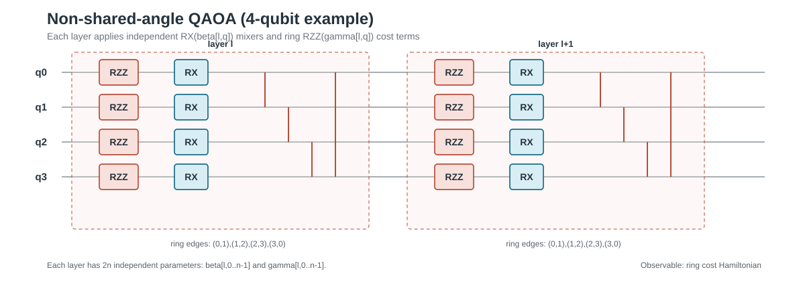
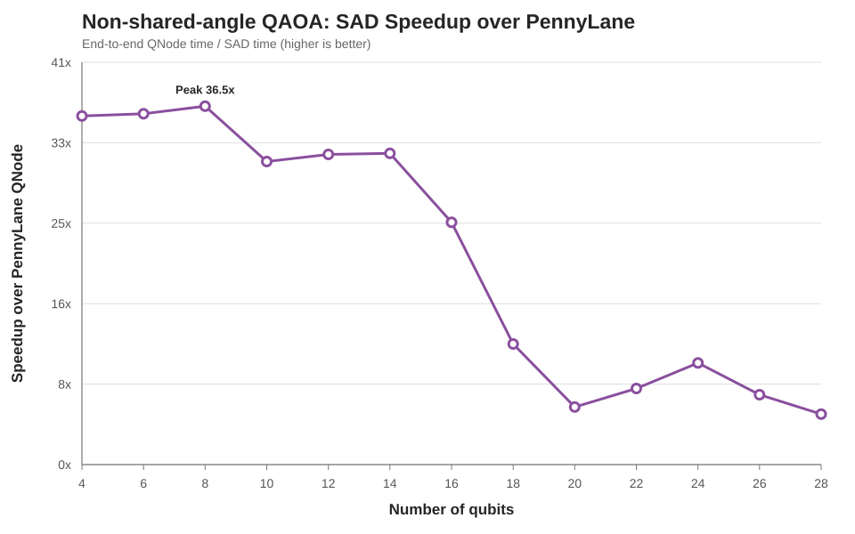

# 0812 新增四种电路：MERA、Equivariant QNN、Data Re-uploading 与 QAOA-NS

## 1. 工作范围

本次新增并完成基准测试的四种电路为：

1. MERA
2. Equivariant QNN（EQNN）
3. Data Re-uploading QNN
4. Non-shared-angle QAOA（QAOA-NS）

四种实现保持相同的输入、参数和测量口径：

| 项目 | 配置 |
|:--|:--|
| GPU | NVIDIA RTX 6000 Ada Generation |
| precision | float64 |
| random seed | 42 |
| qubits | 4, 6, ..., 28 |
| layers | MERA 使用 `ceil(log2(qubits))`；EQNN/Data Re-uploading/QAOA-NS 使用 8 |
| benchmark | SAD optimized、Lightning native、PennyLane QNode |
| 速度定义 | `PennyLane QNode time / SAD time` |

最终数据位于 [native_baseline_comparison_merged.csv](benchmark/results/native_baseline_comparison_merged.csv)，
四张图位于：

- [MERA 加速比](benchmark/results/figures/mera_sad_vs_pennylane_speedup.svg)
- [Equivariant QNN 加速比](benchmark/results/figures/equivariant-qnn_sad_vs_pennylane_speedup.svg)
- [Data Re-uploading 加速比](benchmark/results/figures/data-reuploading_sad_vs_pennylane_speedup.svg)
- [QAOA-NS 加速比](benchmark/results/figures/qaoa-ns_sad_vs_pennylane_speedup.svg)

## 2. 公共实现结构

四种电路均复用同一套 SAD runtime：

```text
Python circuit registry
    -> CircuitExecutor<T>
    -> shared ForwardCircuitContext / BackwardCircuitContext
    -> forward / Hamiltonian / backward CUDA stages
    -> energy + full gradient
```

没有为任何电路增加专用 runner、context、workspace 类型或公共 C API。每种电路只增加
自己的 `LayerLayout`、executor 分支和必要的 private CUDA helper；公共的
`Complex<T>`、`RotationCoefficients<T>`、tile mapping、grid sizing、reduction 和
CUDA error checking 均复用现有实现。

当前默认编译配置为 `f128r2_b128r2`：

| 配置 | 数值 | 含义 |
|:--|--:|:--|
| `SAD_FORWARD_BLOCK_THREADS` | 128 | forward CTA threads |
| `SAD_FORWARD_REGISTER_BITS` | 2 | 每线程 `2^2 = 4` 个 amplitude |
| `SAD_BLOCK_THREADS` | 128 | backward CTA threads |
| `SAD_REGISTER_BITS` | 2 | 每线程 `2^2 = 4` 个 phi/lambda amplitude |
| `SAD_ORDINARY_BLOCK_THREADS` | 128 | ordinary state-vector kernel threads |
| forward/backward tile bits | 9 | `5 lane bits + 2 register bits + 2 warp bits` |

因此默认配置是 `128 threads × 4 amplitudes/thread`，不是 `128 × 8`。`r3` 才表示
`2^3 = 8` amplitudes/thread；项目中也保留了 `f128r3_b64r4`、`f64r4_b128r3` 等
可编译候选 variant，但本次四种电路最终 CSV 的主结果使用 `f128r2_b128r2`。

## 3. MERA

### 3.1 电路构造

MERA 使用 active-wire 层次结构。每个 active level 分为两类 matching：

```text
D（disentangler）：对 active[1]-active[2]、active[3]-active[4]、...
U（coarse graining）：对 active[0]-active[1]、active[2]-active[3]、...
```

每个 pair 执行：

```text
RY(theta_left)
RY(theta_right)
CNOT(left, right)
```

之后保留每个 U pair 的右端 active wire，进入下一层；奇数 active wire 原样保留。层数
要求为 `ceil(log2(qubits))`，参数顺序由 `MeraLayerLayout` 计算 D/U pair 的 offset。
例如 4 qubits 使用 2 layers、8 个参数；28 qubits 使用 5 layers、100 个参数。

PennyLane 构造见 [circuits.py](pennylane-lightning/src/pennylane_lightning_baseline/circuits.py:183)。

下图以 8 qubits 展示三层 active-wire 收缩。蓝色 D 区域表示 disentangler matching，
绿色 U 区域表示 coarse-graining matching；每个 matching pair 都是
`RY(left) + RY(right) + CNOT(left,right)`。



### 3.2 SAD 实现

MERA 使用 [mera.cuh](sad/src/circuits/mera.cuh) 的专用 executor 和
[kernels/mera.cuh](sad/src/kernels/mera.cuh) 的 matching forward/backward kernel：

- 每一层 forward 依次执行 D matching 和 U matching；
- matching pair 在 kernel 内构造 selected map，不使用 host topology map；
- 每个 CTA 加载一个 state tile；
- tile 内使用 shared mailbox 完成 RY 的 wire exchange 和 CNOT gather；
- backward 反向执行 U、D matching，并对每个 RY 参数做 reduction；
- 不把每个 RY/CNOT occurrence 展开为独立 full-state pass。

MERA 的优化重点是 **matching fusion + tile locality**：一个 matching 只启动一次
kernel，kernel 内按 tile 处理多个不相交 pair，从而减少 global state-vector traversal。
MERA 的 Hamiltonian 仍使用专用 Hamiltonian kernel 做线性 state pass。

MERA 的 benchmark observable 是末端 qubit 的 `Z_(n-1)`，与
`build_hamiltonian()` 中的 `PauliZ(qubits - 1)` 对齐。

### 3.3 结果

| 指标 | 4 qubits | 28 qubits |
|:--|--:|--:|
| 参数量 | 8 | 100 |
| SAD time | 0.0841 ms | 1092.799 ms |
| PennyLane QNode time | 4.590 ms | 7183.024 ms |
| SAD/PennyLane 加速比 | 54.58x | 6.57x |



全范围加速比为 `6.45x–54.58x`，峰值出现在 4 qubits。28 qubits 时仍有约 `6.57x`
加速；加速比下降主要来自 state vector 指数增长和 matching kernel 的 tile/显存
处理成本，而不是数值误差。

## 4. Equivariant QNN

### 4.1 电路构造

每层只有三个共享参数 `a_l, b_l, g_l`，参数量固定为 `3 * layers`。逻辑门顺序为：

```text
for wire = 0..n-1: RX(a_l)
for wire = 0..n-1: RY(b_l)
for every unordered pair (i,j), i<j:
    CX(i,j)
    RZ(j, g_l)
    CX(i,j)
```

全连接 pair 由 round-robin matching 生成；奇数 qubits 添加 dummy，但 dummy pair 不产生
门。每层逻辑 occurrence 数为：

```text
RX = n
RY = n
CX = n(n-1)
RZ = n(n-1)/2
```

PennyLane 仍按 occurrence 展开这些门，见 [circuits.py](pennylane-lightning/src/pennylane_lightning_baseline/circuits.py:208)。

下图以 4 qubits 展示一个 macro-layer。所有 qubit 共享 `a_l` 和 `b_l`，六个无序
qubit pair 被划分为三轮互不冲突的 round-robin matching；图中的每个 `ZZ(g)` 在
reference 中均展开为 `CX-RZ(g)-CX`。



### 4.2 SAD 实现与 Phase X 优化

executor 见 [equivariant_qnn.cuh](sad/src/circuits/equivariant_qnn.cuh)。每个 layer 的
SAD 路径为：

```text
shared-parameter RX forward
shared-parameter RY forward
closed-form all-to-all RZZ forward
```

RX/RY 复用 shared-parameter non-diagonal tile kernel。RZZ 原本需要每个 amplitude 内部
枚举 `n(n-1)/2` 个 pair；当前实现已按 Phase X 改为闭式计算，见
[equivariant_qnn.cuh](sad/src/kernels/equivariant_qnn.cuh:7)：


```text
z_sum = n - 2 * popcount(index)
S(index) = (z_sum^2 - n) / 2
phase = u^S,  u = cos(g_l/2) - i sin(g_l/2)
```

forward 使用 binary exponentiation 计算 `u^S`，backward 使用逆相位并按 `S` 累加
共享 `g_l` 梯度。因此全连接 RZZ 不再有 per-amplitude 的双重 pair `for` 循环，
同时不增加 workspace 或 launcher。Hamiltonian 使用 EQNN 专用 observable kernel。

这项优化将 RZZ 计算从“每个 amplitude 顺序执行 (O(n^2)) pair 操作”改为
`popcount + integer complex power`，显著降低 16 qubits 之后的增长速度。

EQNN 的 benchmark observable 是平均单 qubit X：
`H = (1/n) * sum_i X_i`。Hamiltonian kernel 直接构造该对称 observable 的作用，
不使用 diagonal lookup。

### 4.3 结果

| 指标 | 4 qubits | 峰值（16q） | 28 qubits |
|:--|--:|--:|--:|
| 参数量 | 24 | 24 | 24 |
| SAD time | 0.381 ms | 1.255 ms | 12177.879 ms |
| PennyLane QNode time | 19.006 ms | 188.824 ms | 316341.466 ms |
| SAD/PennyLane 加速比 | 49.91x | **150.43x @ 16q** | 25.98x |



加速比序列为：

```text
4q 49.91x, 6q 58.71x, 8q 78.26x, 10q 80.92x, 12q 98.25x,
14q 129.27x, 16q 150.43x, 18q 67.35x, 20q 31.51x,
22q 36.94x, 24q 53.67x, 26q 40.77x, 28q 25.98x
```

峰值之后的下降是可重复的 scaling 现象：PennyLane 仍承担逐门展开和大量 state
vector traversal，而 SAD 虽然消除了 pair loop，仍需处理大小为 (2^n) 的 state vector，
并执行 RX/RY、闭式相位、backward 与 reduction。CSV 中 4–28q 的 SAD energy 误差最大
约 `5.4e-15`，gradient 误差最大约 `1.65e-10`。

## 5. Data Re-uploading QNN

### 5.1 电路构造

Data Re-uploading 每层有 `3n` 个参数，门序固定为：

```text
for wire = 0..n-1: RZ(phi_z[layer, wire])
for wire = 0..n-1: RY(phi_y[layer, wire])
for wire = 0..n-1: RZ(phi_x[layer, wire])
brickwork CZ matching, parity = layer & 1
```

偶数层使用 `(0,1),(2,3),...`，奇数层使用 `(1,2),(3,4),...,(n-1,0)`，要求偶数
qubits 且至少 4 qubits。每层 CZ 数为 `n/2`，CZ 不带可训练参数。8 layers 时参数量
从 4q 的 96 增长到 28q 的 672。

PennyLane 构造见 [circuits.py](pennylane-lightning/src/pennylane_lightning_baseline/circuits.py:230)。

下图以 6 qubits 展示连续两个 layer：每层先执行 `RZ-RY-RZ`，随后执行一组 CZ
matching；偶数层和奇数层使用交错拓扑，奇数层最后一条 CZ 跨接 `(q5,q0)`。



### 5.2 SAD 实现与优化

executor 见 [data_reuploading.cuh](sad/src/circuits/data_reuploading.cuh)：

```text
RZ lookup group 1
generic shared/tile RY
RZ lookup group 2
fused brickwork CZ sign kernel
```

具体优化为：

- 两组 per-wire RZ 预构造为现有 `DiagonalLookupData`，避免在 kernel 内重复生成相位；
- RY 复用 generic non-diagonal tile kernel 和 shared memory mailbox；
- 同一 parity 的全部 CZ 融合为一次专用 `brickwork_forward/backward_kernel`；
- CZ 对 computational-basis amplitude 只产生符号翻转，kernel 直接按 pair parity
  改变 amplitude 符号，不进行 CNOT permutation 或多个 full-state pass；
- CZ 无梯度，backward 对 phi/lambda 应用相同 fused sign，RZ/RY 梯度由公共 kernel
  完成。

专用 CZ kernel 见 [kernels/data_reuploading.cuh](sad/src/kernels/data_reuploading.cuh:5)。

Data Re-uploading 的 benchmark observable 是 `Z_0`。因此它只需一项 Hamiltonian，
而两组 RZ 参数仍然通过每层的 diagonal lookup 参与 forward/backward。

### 5.3 结果

| 指标 | 4 qubits | 峰值（8q） | 28 qubits |
|:--|--:|--:|--:|
| 参数量 | 96 | 192 @ 8q | 672 |
| SAD time | 0.302 ms | 0.430 ms | 5771.475 ms |
| PennyLane QNode time | 11.054 ms | 18.341 ms | 44212.000 ms |
| SAD/PennyLane 加速比 | 36.55x | **42.65x @ 8q** | 7.66x |



全范围加速比为 `7.66x–42.65x`。随着 qubits 增加，state vector 和每层 `3n` 参数化
rotation 的处理成本增长；由于 PennyLane 和 SAD 在大规模时都进入 state-vector
吞吐主导区间，加速比从峰值回落。CSV 中 SAD energy 误差最大约 `5.0e-16`，gradient
误差最大约 `6.8e-15`。

## 6. Non-shared-angle QAOA（QAOA-NS）

### 6.1 电路构造

QAOA-NS 是 ring cost Hamiltonian 上的非共享角 QAOA。要求 qubit 数为不小于 4 的偶数，
每层包含 `n` 个独立的 `gamma` 和 `n` 个独立的 `beta`，因此参数量为 `2nL`。第 `l` 层
的参数布局严格为：

```text
beta[l, 0], ..., beta[l, n-1],
gamma[l, 0], ..., gamma[l, n-1]
```

门序为 cost-first：

```text
for edge = 0..n-1: RZZ(q_edge, q_(edge+1 mod n), gamma[l, edge])
for wire = 0..n-1: RX(q_wire, beta[l, wire])
```

每条 ring edge 和每个 mixer wire 都拥有自己的可训练角，不与同层其他 edge/wire 共享。
示例电路如下：



### 6.2 SAD 实现与 Phase B/C 优化

QAOA-NS executor 见 [qaoa_ns.cuh](sad/src/circuits/qaoa_ns.cuh)，参数布局由
`QaoaNsLayerLayout` 统一计算。每层 forward/backward 路径为：

```text
forward:  nonshared ring-RZZ -> nonshared RX
backward: nonshared RX inverse/gradient -> nonshared ring-RZZ inverse/gradient
```

Phase B 为每条独立 RZZ 参数建立两元素 lookup：

```text
[ exp(-i * gamma / 2), exp(+i * gamma / 2) ]
```

kernel 根据相邻 qubit 是否相异选择 eigenvalue `+1/-1` 的 factor，避免为单个 edge
分配通用 diagonal lookup 的完整 chunk。Phase C 在
[diagonal.cuh](sad/src/kernels/diagonal.cuh) 中增加 RZZ forward tile kernel：

- 一个 block 覆盖一个或多个 forward tile；
- 每个 thread 在寄存器中处理 `2^SAD_FORWARD_REGISTER_BITS` 个 amplitude；
- phase 在寄存器中累乘后一次写回，保持单次 state load/store；
- 小于一个 tile 的 state 自动回退 ordinary kernel，避免低 qubit 场景产生大量空闲线程；
- backward 暂保留 ordinary reduction kernel，保证 gamma 梯度规约与基线一致。

RX 继续复用 `SharedParameter=false` 的 generic non-diagonal tile kernel。Hamiltonian
使用 ring cost observable，energy 和完整 `2nL` 梯度均由同一 SAD C API 返回。

### 6.3 结果

QAOA-NS benchmark 使用 4–28 qubits、8 layers、float64、random seed 42。结果来自
[native_baseline_comparison_qaoans.csv](benchmark/results/native_baseline_comparison_qaoans.csv)：

| 指标 | 4 qubits | 峰值（8q） | 28 qubits |
|:--|--:|--:|--:|
| 参数量 | 64 | 128 | 448 |
| SAD time | 0.230 ms | 0.343 ms | 5862.718 ms |
| PennyLane QNode time | 8.187 ms | 12.537 ms | 30142.438 ms |
| SAD/PennyLane 加速比 | 35.53x | **36.53x @ 8q** | 5.14x |



全范围 QAOA-NS 加速比为 `5.14x–36.53x`。28q 时 SAD 仍保持约 5.14x 加速。CSV 中
native 与 PennyLane 的 energy 误差最大约 `3.6e-15`，gradient 最大误差约 `6.7e-16`；
SAD 与 native 的 gradient 最大误差约 `7.1e-15`。

## 7. 四种电路对比

| 电路 | 主要结构 | SAD 专用优化 | 加速比峰值 | 28q 加速比 |
|:--|:--|:--|--:|--:|
| MERA | 分层 D/U matching，RY + CNOT | matching-aware tile kernel、shared mailbox | 54.58x @ 4q | 6.57x |
| EQNN | n 个 RX、n 个 RY、全连接 RZZ | shared rotations + Phase X 闭式 RZZ | 150.43x @ 16q | 25.98x |
| Data Re-uploading | RZ → RY → RZ → brickwork CZ | RZ lookup、generic RY、fused CZ sign | 42.65x @ 8q | 7.66x |
| QAOA-NS | 独立 beta/gamma 的 ring RZZ + RX | compact RZZ lookup、tile/register forward、RX tile | 36.53x @ 8q | 5.14x |

四者的性能差异对应不同的结构瓶颈：

1. MERA 的拓扑稀疏且层数随 `log2(n)` 增长，主要收益来自 matching 的 tile fusion。
2. EQNN 的 PennyLane reference 包含全连接 (O(n^2)) 门 occurrence；Phase X 消除了
   SAD kernel 中的 pair loop，因此在中等规模达到最高加速比。
3. Data Re-uploading 的 rotation 参数量为 `3nL`，CZ 拓扑只是 brickwork matching；
   RZ lookup 和 fused sign kernel 降低了固定门调度成本，但大规模仍受 state-vector
   处理和大量 trainable rotation 影响。
4. QAOA-NS 的每层参数量为 `2n`，compact lookup 和 RZZ tile kernel 降低了 ring cost
   的访存及 launch 开销，但独立 gamma 梯度仍需要 edge-wise reduction。

## 8. 正确性与结果文件

四种电路均比较 energy 和 full gradient。原三种电路的合并表包含 39 行数据，QAOA-NS
单独结果表包含 13 行数据；两类 CSV 均包含 18 列字段，包括：

```text
SAD / Lightning native / PennyLane QNode median time
speedup_vs_lightning_native
speedup_vs_pennylane_qnode
native 与 SAD 的 energy/gradient 误差
```

EQNN 还经过闭式相位的穷举/采样、float32/float64、角度边界和有限差分测试。四种电路
的结果均保持与 Lightning native/QNode 的数值一致，最终数据以 CSV 为准，图像以 SVG
为准。

## 9. 相关源码与资料

- 电路构造：[circuits.py](pennylane-lightning/src/pennylane_lightning_baseline/circuits.py)
- MERA executor/kernel：[mera.cuh](sad/src/circuits/mera.cuh)、[kernels/mera.cuh](sad/src/kernels/mera.cuh)
- EQNN executor/kernel：[equivariant_qnn.cuh](sad/src/circuits/equivariant_qnn.cuh)、[kernels/equivariant_qnn.cuh](sad/src/kernels/equivariant_qnn.cuh)
- Data Re-uploading executor/kernel：[data_reuploading.cuh](sad/src/circuits/data_reuploading.cuh)、[kernels/data_reuploading.cuh](sad/src/kernels/data_reuploading.cuh)
- QAOA-NS executor/kernel：[qaoa_ns.cuh](sad/src/circuits/qaoa_ns.cuh)、[kernels/diagonal.cuh](sad/src/kernels/diagonal.cuh)
- CUDA 编译常量：[cuda_common.cuh](sad/src/core/cuda_common.cuh)
- kernel variant dispatch：[runner.py](sad/python/sad_baseline/runner.py)
- 合并结果：[native_baseline_comparison_merged.csv](benchmark/results/native_baseline_comparison_merged.csv)
- QAOA-NS 结果：[native_baseline_comparison_qaoans.csv](benchmark/results/native_baseline_comparison_qaoans.csv)
- 绘图脚本：[plot_sad_pennylane_speedups.py](benchmark/plot_sad_pennylane_speedups.py)
- 电路图生成脚本：[generate_circuit_diagrams.py](benchmark/generate_circuit_diagrams.py)
