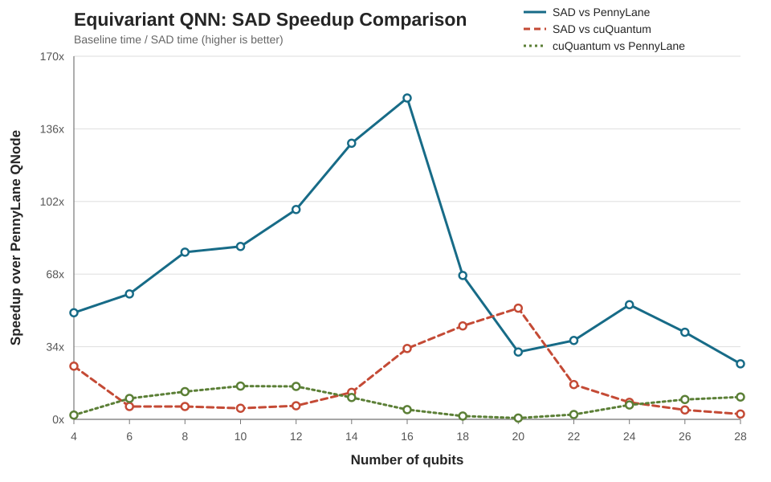
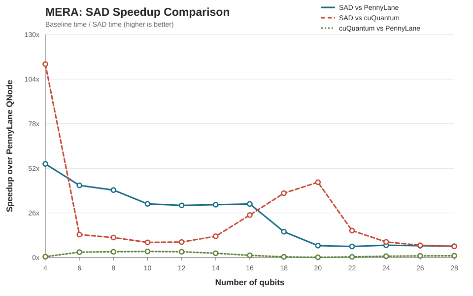
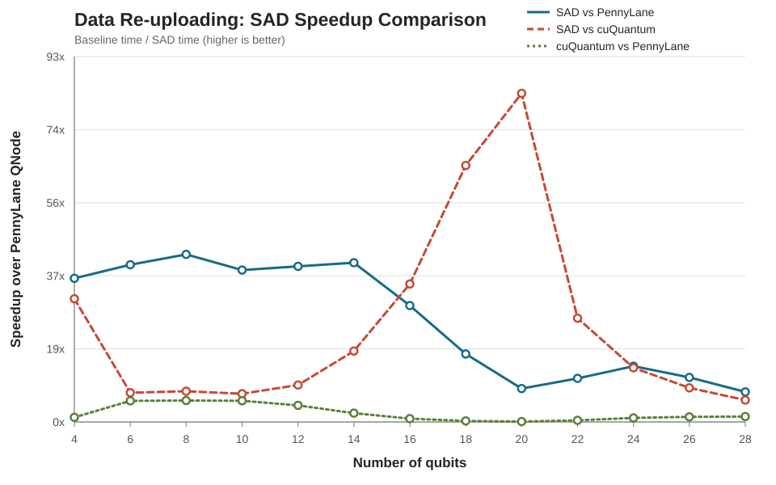
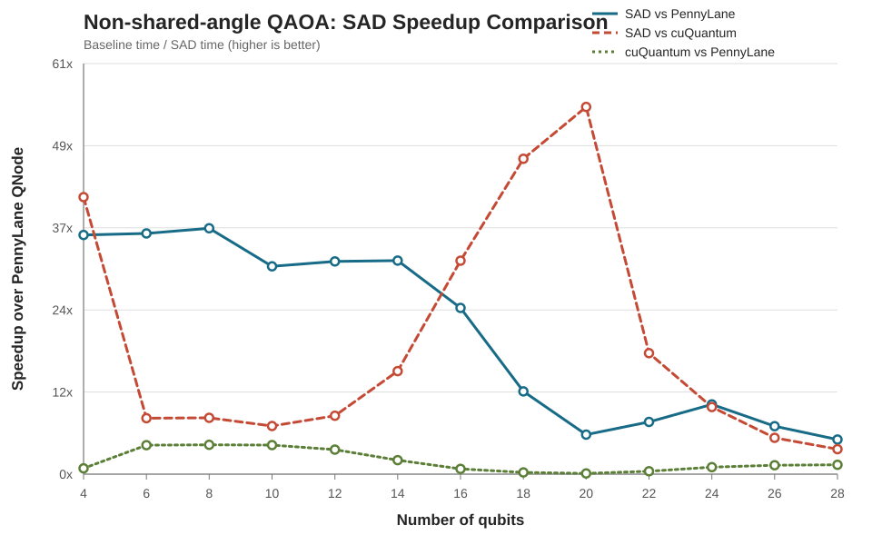

# PennyLane、SAD 与 cuQuantum 性能对比

本文基于合并结果表，对四类电路在不同 qubit 数下的执行时间和加速比进行比较。

## 数据文件

- 合并结果表：[`native_baseline_comparison_merged_cuquantum.csv`](benchmark/results/native_baseline_comparison_merged_cuquantum.csv)
- native 三电路原始表：[`native_baseline_comparison_merged_triple.csv`](benchmark/results/native_baseline_comparison_merged_triple.csv)
- QAOA-NS native 原始表：[`native_baseline_comparison_qaoans.csv`](benchmark/results/native_baseline_comparison_qaoans.csv)
- cuQuantum 原始表：[`cuquantum.csv`](benchmark/results/cuquantum.csv)
- 共享角 QAOA SAD 原始表：[`qaoa_shared_sad_gpu.csv`](benchmark/results/qaoa_shared_sad_gpu.csv)
- 共享角 QAOA PennyLane 原始表：[`qaoa_xxz_pennylane_gpu.csv`](benchmark/results/qaoa_xxz_pennylane_gpu.csv)

合并表以 `circuit`、`qubits`、`layers`、`parameter_count` 和 `precision` 为匹配键，将 cuQuantum 的对应结果以 `cuquantum_` 前缀加入 native 结果。表中共有 52 行，覆盖 4 类电路和 4 到 28 qubits 的偶数规模。

## 加速比定义

图中的三条曲线定义如下：

$$
\text{SAD vs PennyLane} = \frac{T_{\text{PennyLane}}}{T_{\text{SAD}}}
$$

$$
\text{SAD vs cuQuantum} = \frac{T_{\text{cuQuantum}}}{T_{\text{SAD}}}
$$

$$
\text{cuQuantum vs PennyLane} = \frac{T_{\text{PennyLane}}}{T_{\text{cuQuantum}}}
$$

其中的执行时间均采用对应 CSV 中的 median time。加速比大于 1 表示前者更快。

## 结果图

### Equivariant QNN



### MERA



### Data Re-uploading



### Non-shared-angle QAOA



## 结果分析

### 重点：QAOA-NS 的 SAD vs PennyLane 加速比为什么低于共享角 QAOA

`SAD vs PennyLane` 的加速比定义为：

$$
\text{speedup}=\frac{T_{\text{PennyLane}}}{T_{\text{SAD}}}
$$

QAOA-NS 的加速比更低，主要不是因为 PennyLane 在 QAOA-NS 上变慢，而是因为 **SAD 执行 QAOA-NS 的时间明显高于执行共享角 QAOA 的时间**；与此同时，QAOA-NS 的 PennyLane 时间还略低于共享角 QAOA。两者共同使比值下降。

| qubits | 共享 QAOA SAD (s) | 共享 QAOA PennyLane (s) | 加速比 | QAOA-NS SAD (s) | QAOA-NS PennyLane (s) | 加速比 |
|---:|---:|---:|---:|---:|---:|---:|
| 8 | 0.000315 | 0.012854 | 40.78x | 0.000343 | 0.012537 | 36.53x |
| 16 | 0.000660 | 0.024552 | 37.19x | 0.000943 | 0.023285 | 24.69x |
| 20 | 0.007802 | 0.056736 | 7.27x | 0.009057 | 0.053131 | 5.87x |
| 24 | 0.132026 | 1.767160 | 13.38x | 0.159900 | 1.656723 | 10.36x |
| 28 | 3.304430 | 33.373900 | 10.10x | 5.862720 | 30.142400 | 5.14x |

28 qubits 时，QAOA-NS 的 PennyLane 时间比共享角 QAOA 低约 9.7%，但 SAD 时间高约 77.4%。因此，加速比差距主要来自 SAD 端，而不是 PennyLane 端。

#### 原因一：参数和独立梯度数量不同

共享角 QAOA 每层的所有 RX 门共享一个 `beta_l`，所有 RZZ 边共享一个 `gamma_l`，因此 8 layers 时始终只有：

$$
2L=16
$$

个参数。QAOA-NS 中，同层每个 qubit 有独立的 `beta_(l,q)`，每条环边有独立的 `gamma_(l,e)`，总参数数为：

$$
2nL
$$

28 qubits、8 layers 时共有 448 个参数。共享角 QAOA 可以把同一层所有 RX 门的局部梯度贡献累加为一个 `beta_l` 梯度，把所有 RZZ 边的贡献累加为一个 `gamma_l` 梯度。QAOA-NS 则必须分别保留和规约每个 qubit、每条边的梯度，不能将其合并，否则优化器无法独立更新这些角度。

QAOA-NS 并不是为每个参数重新运行一次完整 backward，也不是为同层的 `n` 个 RX 启动 `n` 次 kernel。两种 QAOA 的 RX 都是每层一次 kernel；差别在于 QAOA-NS 必须在同一次 inverse-walk backward 中处理更多独立梯度通道。

#### 原因二：共享角 QAOA 有更强的专用融合

共享角 QAOA 可以使用整层共享 RX、共享 RZZ backward 和共享梯度规约，并在部分 qubit 规模下融合 cost RZZ 与 RX mixer，减少完整状态向量的读写次数。第一层还可融合 `|+>` 初始化与 cost 操作。

QAOA-NS 当前使用 non-shared RX/RZZ 路径：虽然同一层 RX 仍只启动一次 kernel，但 kernel 必须按 qubit 选择不同旋转系数，backward 还要分别规约各个 RX 和 RZZ 参数。当前实现也没有对应的共享 cost-RX 融合路径。因此 qubit 数增大后，QAOA-NS 的 SAD 时间相对共享角 QAOA 增长得更快。

旋转系数数组本身并不大。它存放在 GPU global memory 中，访问时通常由 L1/L2 cache 缓存并进入寄存器，所以“读取不同角度”不是主要瓶颈。更关键的是独立梯度的计算与规约，以及共享角版本能够使用而 QAOA-NS 无法直接使用的 kernel 融合。

#### 原因三：PennyLane 时间没有同比增加

两种 QAOA 每层都执行约 `n` 个 RX 和 `n` 个 RZZ 门。参数共享减少了参数维度，但没有按 `n` 倍减少 PennyLane/Lightning 需要执行的状态向量门操作。因此两者的 PennyLane 时间接近；在本次独立 benchmark 中，QAOA-NS 的 PennyLane median time 甚至略低。

综上，QAOA-NS 的加速比低于共享角 QAOA，核心原因是：**非共享参数削弱了 SAD 的整层共享梯度规约和 kernel 融合优势，使 SAD 分母明显增大，而 PennyLane 分子没有相应增大。**

### cuQuantum 与 SAD

cuQuantum 使用完整状态向量模拟。对于 `n` 个 qubit，需要处理 `2^n` 个复数幅度；局部门作用、Hamiltonian 计算和梯度计算都需要访问大规模状态向量，因此计算量和显存访问量会随 qubit 数呈指数增长。每增加 2 个 qubit，状态向量规模扩大约 4 倍。

SAD 在约 20 qubits 附近出现了性能机制变化：此前主要受 memory-bound 限制，之后转为 compute-bound，计算吞吐成为瓶颈，因此 SAD 的执行时间在该区间明显变慢。这会直接改变相对 cuQuantum 的曲线形状：

- 18 qubits 之前，cuQuantum 的状态向量成本快速增长，而 SAD 仍处于较有利的 memory-bound 区间，因此 `SAD vs cuQuantum` 的速度比呈明显的指数式增长趋势。
- 在 20 qubits 附近，SAD 本身发生 memory-bound 到 compute-bound 的转折，速度比仍可能增长，但不再保持此前的指数增长趋势。
- 20 qubits 之后，SAD 的 compute-bound 开销明显增加，`SAD vs cuQuantum` 的速度比反而下降，说明 SAD 的性能优势被自身的计算瓶颈部分抵消。

因此，`SAD vs cuQuantum` 不是单纯由 cuQuantum 的指数复杂度决定的，还受到 SAD 在不同规模下硬件瓶颈变化的共同影响。

### PennyLane

本 benchmark 中的 PennyLane 使用状态向量后端，同样需要维护 `2^n` 个复数幅度，所以其渐近计算成本也随 qubit 数指数增长。不过在小规模电路中，状态向量处理不是唯一的主要成本，PennyLane 还包含 Python/QNode 调度、GPU kernel 启动以及其他固定运行开销。这些固定开销会掩盖状态向量规模带来的增长，因此 4 到约 20 qubits 区间的曲线增长并不明显。

随着 qubit 数增大，状态向量处理逐渐成为主要成本，指数增长才会表现得更明显。例如 Equivariant QNN 的 PennyLane median time 为：

| qubits | median time (s) |
|---:|---:|
| 16 | 0.188824 |
| 18 | 0.262657 |
| 20 | 0.447624 |
| 22 | 2.201396 |
| 24 | 15.161129 |
| 26 | 69.524918 |
| 28 | 316.341466 |

从 22 qubits 开始，相邻每增加 2 个 qubit，执行时间大致增长 4 到 7 倍，已经接近状态向量规模扩大 4 倍所预期的趋势。

需要区分的是，PennyLane 是编程框架，具体复杂度取决于后端；上述结论适用于本实验使用的状态向量后端，不代表所有 PennyLane 后端或真实量子硬件。

## 附：QAOA-NS 梯度的存储与处理

QAOA-NS 的每一层包含 `n` 个独立 RX 参数和 `n` 个独立 RZZ 参数，因此每层需要输出 `2n` 个梯度标量。这里保存的是参数梯度，不是 `2n` 个状态向量。

对于第 `layer` 层，梯度数组采用以下连续布局：

```text
base = 2 * layer * qubits

gradients[base ... base + n - 1]
    -> beta_0 ... beta_(n-1) 的 RX 梯度

gradients[base + n ... base + 2n - 1]
    -> gamma_0 ... gamma_(n-1) 的 RZZ 梯度
```

整个电路的最终梯度保存在一个连续的 GPU global memory 数组中，总大小为：

$$
2nL \times 8\ \text{bytes}
$$

这里的梯度累加器使用 double。以 20 qubits、8 layers 为例，共有 `2 x 20 x 8 = 320` 个梯度，只占 2560 bytes，因此最终梯度数组本身并不大。

### RX 梯度规约

每个 GPU 线程先根据自己负责的状态向量幅度计算某个 RX 参数的局部梯度贡献。一个 block 内的线程通过 shared memory 对这些局部值进行规约，再由一个线程使用 `atomicAdd` 将 block 的部分结果累加到 global memory 中对应的梯度位置：

```text
线程局部梯度
    -> shared memory block reduction
    -> atomicAdd
    -> gradients[base + qubit]（global memory）
```

不同 block 对同一个参数产生的部分结果最终累加为该参数的完整梯度。

### RZZ 边梯度规约

RZZ backward kernel 一次处理同一层的所有环边。每个线程计算其对各条边的局部贡献，临时结果保存在 shared memory 的 `overlaps` 和 `warp_partials` 数组中。随后依次进行 warp 内规约和 block 内规约，最终写入：

```text
gradients[base + qubits + edge]
```

因此，shared memory 只保存计算过程中的临时部分和；最终梯度仍保存在 global memory。

### 梯度回传

每次 backward 开始前，global memory 中的完整梯度数组会被清零。所有层反向传播结束后，该数组通过 Device-to-Host copy 复制到 CPU pinned memory，再返回为 Python/NumPy 数组，并可写入 CSV 的 `grad_json` 字段。完整的数据路径为：

```text
线程寄存器
    -> shared memory 临时规约
    -> GPU global memory 最终梯度数组
    -> CPU pinned memory
    -> Python NumPy 数组 / CSV
```

QAOA-NS 仍然只执行一次 inverse-walk backward，并不是为每个参数重新运行一次完整反向传播。相较共享角 QAOA，它需要在同一次 backward 中分别保留、规约和写回 `2nL` 个独立梯度，不能把同层不同 qubit 或不同边的贡献合并为少数共享参数。
