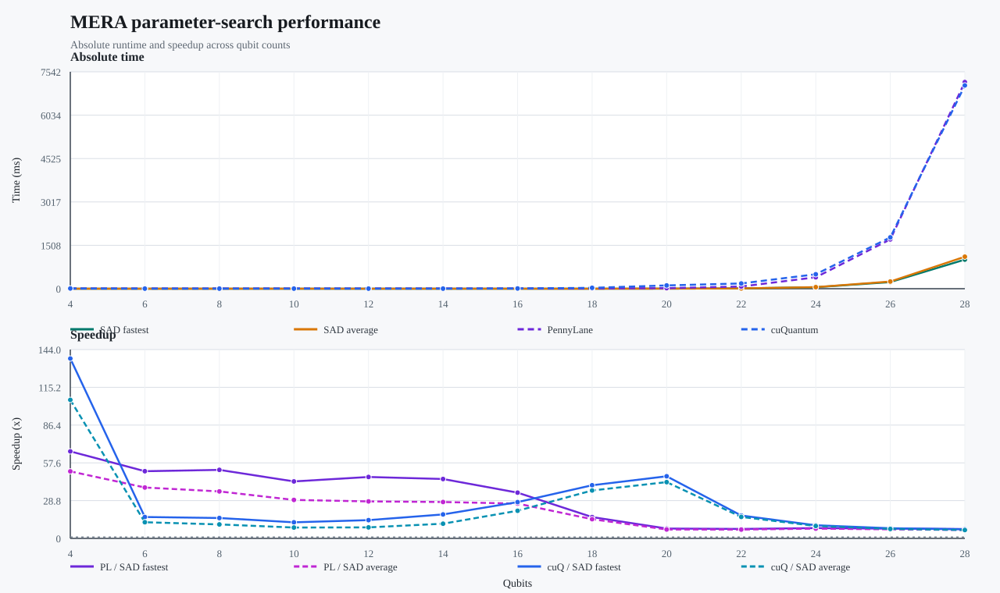
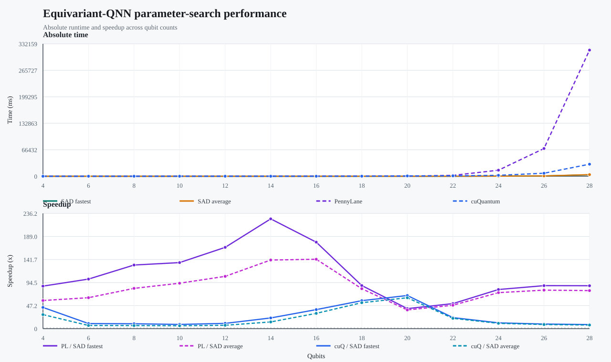
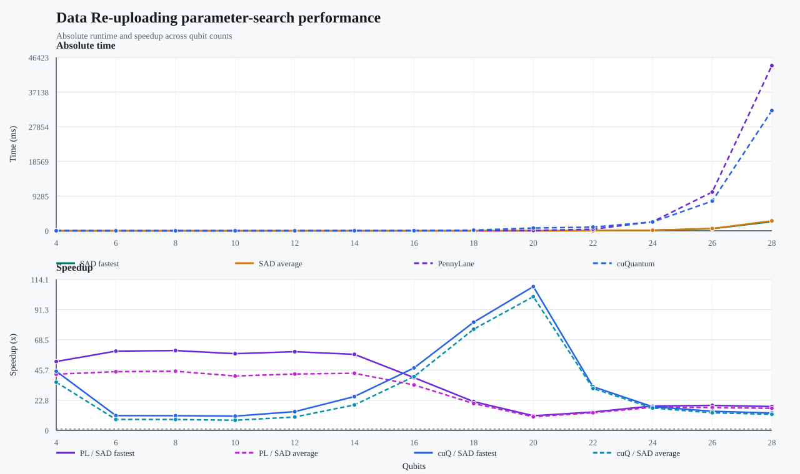
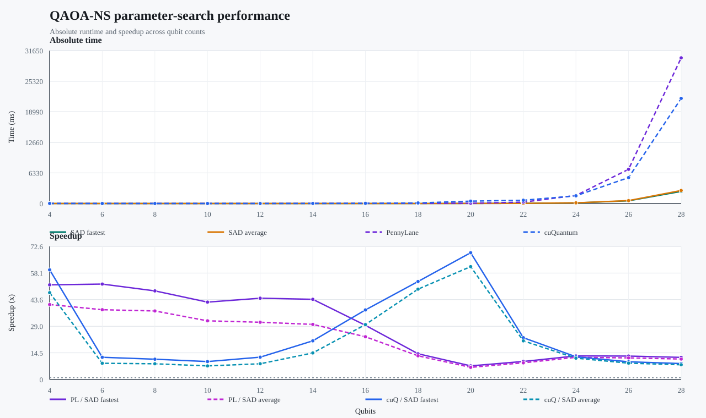

# 四个电路参数搜索与基准对比

> 生成时间：`2026-08-18T16:00:35.442092+00:00`

## 口径

本报告使用四个参数搜索 CSV/JSON 中每个 qubit 的**当前最快已完成组合**。搜索时间为完整 `forward + Hamiltonian + backward` 调用的 `median_ms`。
每个 qubit 同时保留该搜索结果的最快、最慢和平均搜索时间。最优候选的 `forward_phase_plan` 和 `backward_phase_plan` 取自原始 CSV。

加速比定义为：

```text
PennyLane 加速比 = PennyLane median time / 搜索最优 SAD median time
cuQuantum 加速比 = cuQuantum median time / 搜索最优 SAD median time
```

PennyLane 和 cuQuantum 时间来自 `benchmark/results/native_baseline_comparison_merged_cuquantum.csv`，时间单位统一为 ms。搜索 JSON 中的最快组合是候选筛选结果，不等同于已经写入生产 dispatch 的最终配置。

## 总览

| 电路 | 已完成 | 失败 | 搜索最优几何均值(ms) | PennyLane/SAD 几何均值 | cuQuantum/SAD 几何均值 |
|---|---:|---:|---:|---:|---:|
| MERA | 364 | 19 | 1.503 | 21.469x | 19.365x |
| Equivariant-QNN | 456 | 13 | 5.250 | 101.446x | 18.561x |
| Data Re-uploading | 547 | 39 | 4.070 | 31.555x | 24.254x |
| QAOA-NS | 458 | 13 | 3.761 | 23.424x | 19.694x |

## MERA

| qubits | 最快 ms | 平均 ms | 最慢 ms | 最快阶段 | PennyLane ms | PL/SAD | cuQuantum ms | cuQ/SAD | 执行参数 |
|---:|---:|---:|---|---:|---:|---:|---:|---:|---|
| 4 | 0.069 | 0.090 | 0.131 | `reduction` | 4.590 | 66.370x | 9.484 | 137.132x | `F:t32r2m1-C[4]/B:t32r2m1-C[4]` |
| 6 | 0.103 | 0.137 | 0.212 | `reduction` | 5.296 | 51.215x | 1.686 | 16.301x | `F:t32r2m1-C[6]/B:t64r2m1-C[6]` |
| 8 | 0.112 | 0.164 | 0.267 | `reduction` | 5.876 | 52.250x | 1.743 | 15.502x | `F:t64r2m1-C[8]/B:t32r2m1-C[7+1]` |
| 10 | 0.156 | 0.232 | 0.385 | `reduction` | 6.792 | 43.425x | 1.917 | 12.256x | `F:t64r2m1-C[8+2]/B:t32r2m1-C[7+3]` |
| 12 | 0.156 | 0.259 | 0.452 | `reduction` | 7.314 | 46.798x | 2.173 | 13.906x | `F:t32r2m1-C[7+5]/B:t32r2m1-C[7+5]` |
| 14 | 0.178 | 0.291 | 0.531 | `reduction` | 8.075 | 45.302x | 3.252 | 18.241x | `F:t32r2m1-C[7+7]/B:t32r2m1-C[7+7]` |
| 16 | 0.264 | 0.347 | 0.601 | `ordinary_threads` | 9.200 | 34.844x | 7.299 | 27.644x | `F:t64r2m1-C[8+8]/B:t64r2m1-C[8+8]` |
| 18 | 0.726 | 0.806 | 1.016 | `backward_shape` | 11.806 | 16.271x | 29.405 | 40.527x | `F:t64r2m1-C[8+8+2]/B:t128r2m1-C[9+9]` |
| 20 | 2.419 | 2.673 | 3.365 | `forward_shape` | 18.073 | 7.471x | 114.587 | 47.367x | `F:t128r2m1-C[9+9+2]/B:t128r2m1-C[9+9+2]` |
| 22 | 10.424 | 11.133 | 13.185 | `reduction` | 74.757 | 7.172x | 181.984 | 17.458x | `F:t64r2m1-C[8+8+6]/B:t64r2m1-C[8+8+6]` |
| 24 | 50.232 | 53.212 | 60.375 | `reduction` | 395.551 | 7.874x | 502.755 | 10.009x | `F:t256r2m1-C[10+10+4]/B:t64r3m1-C[9+9+6]` |
| 26 | 231.147 | 248.952 | 275.199 | `reduction` | 1714.363 | 7.417x | 1784.926 | 7.722x | `F:t256r2m1-C[10+10+6]/B:t64r3m1-C[9+9+8]` |
| 28 | 1012.003 | 1113.448 | 1310.221 | `ordinary_threads` | 7183.024 | 7.098x | 7067.472 | 6.984x | `F:t128r4m1-C[11+11+6]/B:t32r4m1-C[9+9+9+1]` |



## Equivariant-QNN

| qubits | 最快 ms | 平均 ms | 最慢 ms | 最快阶段 | PennyLane ms | PL/SAD | cuQuantum ms | cuQ/SAD | 执行参数 |
|---:|---:|---:|---|---:|---:|---:|---:|---:|---|
| 4 | 0.218 | 0.330 | 0.611 | `reduction` | 19.006 | 87.156x | 9.484 | 43.492x | `F:t32r2m1-C[4]/B:t32r2m1-C[4]` |
| 6 | 0.263 | 0.420 | 0.810 | `reduction` | 26.690 | 101.616x | 2.734 | 10.410x | `F:t32r2m2-C[6]/B:t32r2m2-C[6]` |
| 8 | 0.333 | 0.526 | 0.949 | `reduction` | 43.438 | 130.413x | 3.349 | 10.053x | `F:t64r2m2-C[8]/B:t64r2m2-C[8]` |
| 10 | 0.476 | 0.692 | 1.245 | `reduction` | 64.453 | 135.357x | 4.143 | 8.701x | `F:t32r2m1-C[L5R2W0-L3R0W0]/B:t32r2m1-C[L5R2W0-L3R0W0]` |
| 12 | 0.540 | 0.840 | 1.579 | `reduction` | 90.030 | 166.678x | 5.839 | 10.810x | `F:t32r2m2-C[L5R2W0-L5R0W0]/B:t32r2m2-C[L5R2W0-L5R0W0]` |
| 14 | 0.592 | 0.947 | 1.831 | `backward_shape` | 133.225 | 224.981x | 13.028 | 22.001x | `F:t32r2m1-C[7+7]/B:t32r2m1-C[7+7]` |
| 16 | 1.065 | 1.328 | 2.254 | `backward_shape` | 188.824 | 177.242x | 41.617 | 39.065x | `F:t64r2m1-C[8+8]/B:t64r2m1-C[8+8]` |
| 18 | 2.974 | 3.206 | 3.851 | `backward_shape` | 262.657 | 88.329x | 170.634 | 57.383x | `F:t128r2m1-C[9+9]/B:t32r2m1-C[7+7+4]` |
| 20 | 10.880 | 11.679 | 13.951 | `forward_phase` | 447.624 | 41.141x | 739.626 | 67.979x | `F:t32r3m1-C[L5R3W0-L5R3W0-L4R0W0]/B:t32r2m1-C[7+7+6]` |
| 22 | 42.886 | 45.806 | 53.518 | `forward_phase` | 2201.396 | 51.331x | 971.633 | 22.656x | `F:t64r3m1-C[L5R3W1-L5R3W1-L4R0W0]/B:t32r3m1-C[8+8+6]` |
| 24 | 188.932 | 205.549 | 244.354 | `ordinary_threads` | 15161.129 | 80.247x | 2256.785 | 11.945x | `F:t32r3m2-C[8+8+8]/B:t32r4m2-C[9+9+6]` |
| 26 | 788.936 | 880.173 | 1022.659 | `forward_phase` | 69524.918 | 88.125x | 7494.541 | 9.500x | `F:t32r4m1-C[9+9+8]/B:t32r4m1-C[9+9+8]` |
| 28 | 3597.894 | 4056.981 | 4667.517 | `reduction` | 316341.466 | 87.924x | 30261.973 | 8.411x | `F:t128r3m2-C[10+10+8]/B:t128r3m2-C[10+10+8]` |



## Data Re-uploading

| qubits | 最快 ms | 平均 ms | 最慢 ms | 最快阶段 | PennyLane ms | PL/SAD | cuQuantum ms | cuQ/SAD | 执行参数 |
|---:|---:|---:|---|---:|---:|---:|---:|---:|---|
| 4 | 0.212 | 0.260 | 0.391 | `diagonal_reduction` | 11.054 | 52.058x | 9.484 | 44.662x | `F:t32r2m2-C[4]/B:t32r2m2-C[4]` |
| 6 | 0.243 | 0.328 | 0.535 | `diagonal_reduction` | 14.554 | 59.888x | 2.709 | 11.149x | `F:t32r2m2-C[6]/B:t32r2m2-C[6]` |
| 8 | 0.304 | 0.410 | 0.639 | `diagonal_reduction` | 18.341 | 60.324x | 3.366 | 11.070x | `F:t64r2m1-C[8]/B:t64r2m1-C[8]` |
| 10 | 0.377 | 0.532 | 0.878 | `diagonal_reduction` | 21.843 | 57.966x | 4.052 | 10.754x | `F:t32r2m2-C[7+3]/B:t32r2m2-C[7+3]` |
| 12 | 0.427 | 0.597 | 1.000 | `diagonal_reduction` | 25.396 | 59.491x | 6.033 | 14.132x | `F:t32r2m2-C[7+5]/B:t32r2m2-C[7+5]` |
| 14 | 0.510 | 0.679 | 1.172 | `rotation_reduction` | 29.314 | 57.438x | 13.056 | 25.582x | `F:t32r2m2-C[L5R2W0-L5R2W0]/B:t32r2m2-C[L5R2W0-L5R2W0]` |
| 16 | 0.874 | 1.015 | 1.488 | `backward_shape` | 34.836 | 39.839x | 41.286 | 47.215x | `F:t64r2m1-C[8+8]/B:t64r2m1-C[8+8]` |
| 18 | 2.080 | 2.223 | 2.511 | `backward_shape` | 45.076 | 21.673x | 170.072 | 81.774x | `F:t128r2m1-C[9+9]/B:t32r2m1-C[7+7+4]` |
| 20 | 6.781 | 7.289 | 7.935 | `rotation_reduction` | 74.818 | 11.033x | 737.153 | 108.702x | `F:t64r2m1-C[8+8+4]/B:t32r2m1-X[L5R2W0-L0R2W0-L0R2W0-L0R2W0-L0R2W0-L0R2W0-L0R2W0-L0R1W0]` |
| 22 | 29.746 | 30.961 | 34.476 | `lookup_bits` | 412.149 | 13.856x | 981.864 | 33.009x | `F:t64r3m1-C[L5R3W1-L5R3W1-L4R0W0]/B:t32r3m1-C[L5R3W0-L5R3W0-L5R1W0]` |
| 24 | 132.002 | 139.411 | 160.329 | `ordinary_threads` | 2426.496 | 18.382x | 2355.426 | 17.844x | `F:t32r3m2-C[8+8+8]/B:t32r4m2-C[9+9+6]` |
| 26 | 550.000 | 599.393 | 691.085 | `ordinary_threads` | 10375.900 | 18.865x | 7949.217 | 14.453x | `F:t32r4m1-C[9+9+8]/B:t32r4m1-C[9+9+8]` |
| 28 | 2451.255 | 2657.534 | 2965.586 | `rotation_reduction` | 44212.000 | 18.036x | 32170.375 | 13.124x | `F:t128r3m2-C[10+10+8]/B:t128r3m2-C[10+10+8]` |



## QAOA-NS

| qubits | 最快 ms | 平均 ms | 最慢 ms | 最快阶段 | PennyLane ms | PL/SAD | cuQuantum ms | cuQ/SAD | 执行参数 |
|---:|---:|---:|---|---:|---:|---:|---:|---:|---|
| 4 | 0.159 | 0.200 | 0.314 | `backward_shape` | 8.187 | 51.635x | 9.483 | 59.807x | `F:t32r2m1-C[4]/B:t64r2m1-C[4]` |
| 6 | 0.197 | 0.269 | 0.451 | `reduction` | 10.244 | 52.046x | 2.383 | 12.107x | `F:t32r2m2-C[6]/B:t32r2m2-C[6]` |
| 8 | 0.259 | 0.335 | 0.574 | `reduction` | 12.537 | 48.337x | 2.872 | 11.075x | `F:t64r2m2-C[8]/B:t32r2m2-C[L5R2W0-L1R0W0]` |
| 10 | 0.347 | 0.457 | 0.733 | `reduction` | 14.639 | 42.194x | 3.389 | 9.767x | `F:t32r2m2-C[7+3]/B:t32r2m2-C[7+3]` |
| 12 | 0.381 | 0.541 | 0.880 | `backward_shape` | 16.894 | 44.337x | 4.637 | 12.170x | `F:t32r2m1-C[7+5]/B:t32r2m1-C[7+5]` |
| 14 | 0.444 | 0.646 | 1.467 | `reduction` | 19.424 | 43.752x | 9.367 | 21.100x | `F:t32r2m2-C[L5R2W0-L5R2W0]/B:t32r2m2-C[L5R2W0-L5R2W0]` |
| 16 | 0.788 | 0.999 | 1.741 | `reduction` | 23.285 | 29.549x | 29.905 | 37.950x | `F:t64r2m2-C[L5R2W1-L5R2W1]/B:t32r3m2-C[8+8]` |
| 18 | 2.147 | 2.329 | 2.861 | `reduction` | 30.114 | 14.028x | 114.773 | 53.465x | `F:t256r2m1-C[10+8]/B:t32r2m1-C[L5R2W0-L5R2W0-L4R0W0]` |
| 20 | 7.148 | 8.027 | 8.921 | `ordinary_threads` | 53.131 | 7.433x | 494.210 | 69.139x | `F:t64r2m1-C[L5R2W1-L5R2W1-L4R0W0]/B:t32r2m1-C[7+7+6]` |
| 22 | 29.366 | 31.766 | 35.926 | `reduction` | 288.919 | 9.839x | 669.742 | 22.807x | `F:t128r2m1-C[L5R2W2-L5R2W2-L4R0W0]/B:t32r3m1-C[8+8+6]` |
| 24 | 128.700 | 137.060 | 156.304 | `ordinary_threads` | 1656.723 | 12.873x | 1594.003 | 12.385x | `F:t32r3m1-C[8+8+8]/B:t32r4m1-C[9+9+6]` |
| 26 | 554.474 | 601.069 | 676.643 | `ordinary_threads` | 7083.551 | 12.775x | 5360.638 | 9.668x | `F:t32r4m1-C[9+9+8]/B:t32r4m1-C[9+9+8]` |
| 28 | 2499.321 | 2703.351 | 2998.348 | `forward_phase` | 30142.438 | 12.060x | 21754.932 | 8.704x | `F:t128r3m1-C[10+10+8]/B:t128r3m1-C[10+10+8]` |



## 注意事项

- 搜索 JSON 中的 `failed_rows` 是编译资源限制或运行失败的候选，不参与最快、最慢和平均时间统计。
- 执行参数按 `F:t<threads>r<register_bits>m<mailbox_chunks>-C[<phase_counts>]/B:t<threads>r<register_bits>m<mailbox_chunks>-C[<phase_counts>]` 表示。`C[7+5]` 表示两个 phase 分别引入 7 和 5 个新 target；显式非均匀计划使用 `L`、`R`、`W`，`X` 表示 fixed-low-5。
- PennyLane、cuQuantum 与 SAD 的 benchmark 均使用 float64 和相同 qubit 列表；除 MERA 使用其拓扑要求的 `ceil(log2(qubits))` layers 外，其余电路使用 8 layers。具体 warmup/steps 以各自 CSV 字段为准。
- 加速比大于 `1x` 表示搜索最优 SAD 更快；小于 `1x` 表示对应基准更快。
- 本报告只做时间比较，不重新验证能量/梯度正确性；正确性字段仍保留在原始 benchmark CSV 中。
